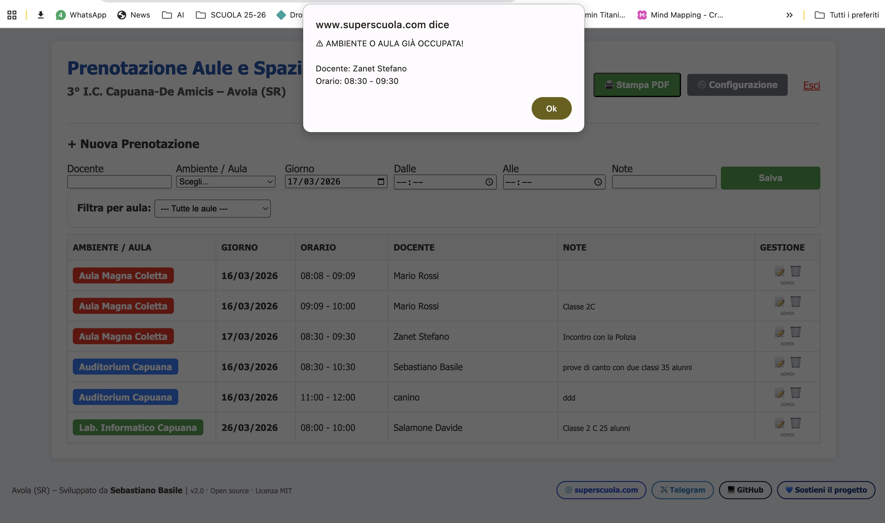
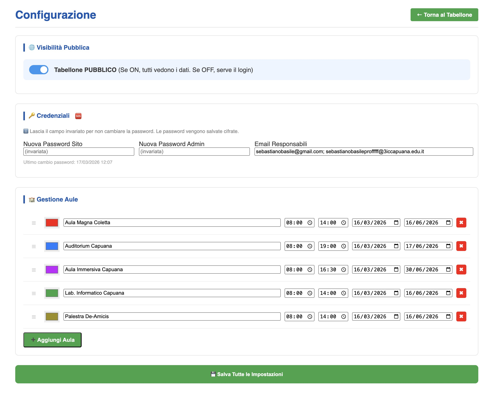
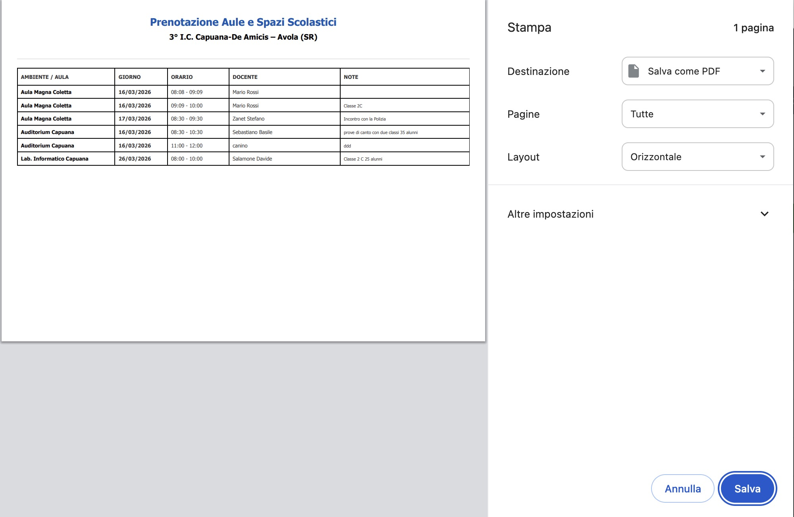
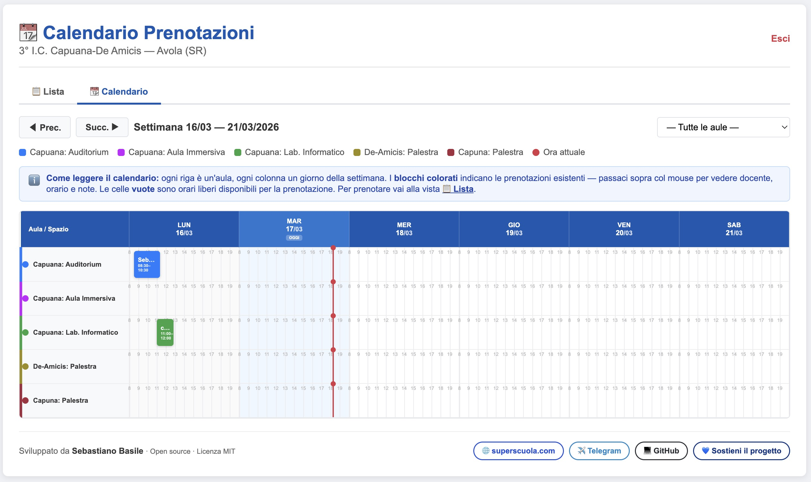

# 📅 Prenotazione Aule e Spazi Scolastici

> Sistema web per la gestione e prenotazione di aule, laboratori e spazi scolastici — semplice, sicuro, senza database.

[](LICENSE)
[](https://php.net)
[](https://superscuola.com/prenotazionicapuana)

---

## 🌐 Demo live

**[→ superscuola.com/prenotazionicapuana](https://superscuola.com/prenotazionicapuana)**

---

## 📸 Screenshots

| Tabellone prenotazioni | Configurazione Admin | Stampa PDF | Calendario |
|---|---|---|---|
|  |  |  |  |

---

## ✨ Funzionalità

- 📋 **Tabellone prenotazioni** — visualizzazione pubblica o con login, filtrabile per aula
- ➕ **Prenotazione rapida** — form inline, verifica conflitti in tempo reale
- 🔒 **Doppio accesso** — password docenti (prenotazione) + password admin (gestione completa)
- ⚙️ **Pannello admin** — gestione aule, colori, orari e periodi di disponibilità, drag & drop per riordinare
- 🖨️ **Stampa / PDF** — layout ottimizzato, crediti esclusi automaticamente
- 🛡️ **Sicurezza** — CSRF, brute force protection, `password_hash` bcrypt, file locking, log azioni
- 📧 **Notifiche email** — invio automatico ai responsabili ad ogni nuova prenotazione o modifica
- 📁 **Zero database** — tutti i dati in file JSON, nessuna configurazione MySQL

---

## 🚀 Installazione

### Requisiti
- PHP **7.4+** (testato su 7.4, 8.0, 8.1, 8.2)
- Hosting con supporto PHP (qualsiasi provider)
- Nessun database necessario

### Procedura

1. **Scarica** il repository o il [pacchetto ZIP](../../releases/latest)

2. **Rinomina** i file di configurazione:
   ```
   impostazioni.example.json  →  impostazioni.json
   prenotazioni.example.json  →  prenotazioni.json
   _htaccess                  →  .htaccess
   ```

3. **Modifica** `impostazioni.json` con i tuoi dati (email notifiche, aule, orari)

4. **Carica** tutti i file sul tuo hosting via FTP o cPanel

5. **Verifica** che il server web abbia permessi di scrittura (chmod 664) su:
   - `prenotazioni.json`
   - `impostazioni.json`
   - `log_azioni.txt`

6. **Accedi** a `login.php` con le credenziali predefinite:
   - Password sito: `Scuola2026`
   - Password admin: `Admin2026`

7. **Cambia subito le password** da *Configurazione → Credenziali* — verranno cifrate con bcrypt

---

## 📁 Struttura file

```
prenotazione-aule/
├── index.php              # Tabellone principale + form prenotazione
├── login.php              # Pagina di accesso
├── logout.php             # Logout
├── admin_settings.php     # Pannello configurazione admin
├── richiedi_azione.php    # Modifica/elimina con verifica admin
├── cancella_rapida.php    # Cancellazione rapida (POST + CSRF)
├── config.php             # Funzioni core, sessioni, CSRF, log
├── style.css              # Foglio di stile
├── _htaccess              # (rinominare in .htaccess) protezione file JSON
├── impostazioni.json      # Configurazione: password, aule, email
├── prenotazioni.json      # Database prenotazioni
├── log_azioni.txt         # Log operazioni admin
└── screenshots/           # Screenshot per documentazione
```

---

## ⚙️ Configurazione aule

Dal pannello admin puoi aggiungere e gestire le aule con:

| Campo | Descrizione |
|---|---|
| Nome | Nome visualizzato nel tabellone |
| Colore | Colore del badge identificativo |
| Orario | Fascia oraria prenotabile (es. 08:00 – 14:00) |
| Periodo | Date di inizio e fine disponibilità |

Le aule si riordinano con drag & drop.

---

## 🔐 Sicurezza

| Funzione | Implementazione |
|---|---|
| Password | `password_hash()` bcrypt, compatibile con testo in chiaro in transizione |
| CSRF | Token per tutti i form POST |
| Brute force | Blocco dopo 5 tentativi per 5 minuti |
| File JSON | Protetti da accesso diretto via `.htaccess` |
| Log | Tutte le operazioni admin registrate con IP e timestamp |
| Input | `htmlspecialchars()` + `strip_tags()` su tutti i dati utente |

### Recupero password dimenticata

1. Accedi al file `impostazioni.json` via FTP o cPanel
2. Sostituisci il valore cifrato con una password in chiaro:
   ```json
   "password_admin": "NuovaPassword"
   ```
3. Salva, accedi normalmente, poi vai in *Configurazione* e risalva per ricifrare

---

## 🖨️ Stampa e PDF

Clicca **Stampa** dal tabellone: il browser apre la finestra di stampa con layout ottimizzato. Tutti gli elementi di interfaccia (form, bottoni, crediti, filtri) vengono nascosti automaticamente — rimangono solo intestazione e tabella dati.

---

## 💙 Sostieni il progetto

Questo software è gratuito e open source. Se ti è utile, considera un contributo:

**[→ Sostieni su PayPal](https://paypal.me/superscuola)**

---

## 👨‍💻 Autore

**Sebastiano Basile**
- 🌐 [superscuola.com](https://superscuola.com)
- ✈️ [Canale Telegram @sostegno](https://t.me/sostegno)
- 💻 [GitHub @sebastianobasile](https://github.com/sebastianobasile)

Sviluppato per **I.C. Capuana-De Amicis — Avola (SR)**

---

## 📄 Licenza

Distribuito con licenza **MIT**. Vedi il file [LICENSE](LICENSE) per i dettagli.

Sei libero di usare, modificare e distribuire questo software, anche per uso commerciale, a condizione di mantenere il riferimento all'autore originale.
